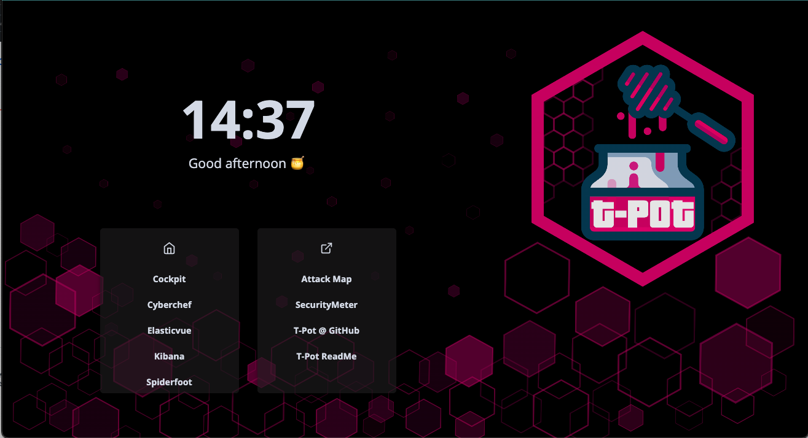

# AWSome Honey Pot

Hello! Welcome to the code that I've written called the AWSome Honey Pot. The purpose of the repository is to house Terraform templates and files that are used to create a HoneyPot within AWS using [T-Pot](https://github.com/telekom-security/tpotce).

I've received a lot of my guidance on how to create this from the following articles:

- [Creating a Research Honeypot on AWS](https://blog.devgenius.io/creating-a-research-honeypot-on-aws-b0ded134729a)

It is a fantastic read, and I do encourage you all to read this article.

---

## Prerequisities

In order to execute deploy this infrastructure, you'll need to ensure you have the following installed:

1. Subscribe to [Debian Buster AMI](https://aws.amazon.com/marketplace/pp/prodview-vh2uh3o4pdfow)<span style="color:red"> - **ABSOLUTE REQUIREMENT!** </span>
2. Terraform v1.3+
3. AWS CLI
    >**NOTE** You'll need to have this installed so you can configure your aws profile prior to deployment.

For more information about installing the necessary technologies, feel free to check out these resources:
- [Terraform Installation Guide](https://developer.hashicorp.com/terraform/tutorials/aws-get-started/install-cli).
- [Installing AWS CLI](https://docs.aws.amazon.com/cli/latest/userguide/getting-started-install.html)

---

## Deployment to AWS

Assuming you have your AWS CLI configured properly for your account, you'll need to execute the following commands:

1. Modify the `main.tf` file inside of the workspace folder and insert your a list of IP addresses that you would like to access the administration panel and SSH into the machine.

    ```terraform
    resource "aws_security_group" "tpot_security_group" {
        ...

        ingress {
            from_port   = 64294
            to_port     = 64294
            protocol    = "tcp"
            cidr_blocks = ["your_ip_addr_cidr"] # Change your IP address here
        }
        ingress {
            from_port   = 64295
            to_port     = 64295
            protocol    = "tcp"
            cidr_blocks = ["your_ip_addr_cidr"] # Change to your IP address here
        }
        ingress {
            from_port   = 64297
            to_port     = 64297
            protocol    = "tcp"
            cidr_blocks = ["your_ip_addr_cidr"] # Change to your IP address here
        }

        ...
    }
    ```

2. Initialize Terraform
    ```bash
    $ terraform init
    ```

3. Apply the entire plan to the AWS account
    ```bash
    $ terraform apply -auto-approve
    ```
    >**NOTE**: This will take between 15-30 minutes. Feel free to step away while this is working. It is deploying your infrastructure to your account.

    Once the plan has been created and applied, a private key should be created within the workspace folder called `hp_key_pair.pem`. You can use this key to ssh into the instance.

4. Verify that everything is up.
    
    1. Log into the admin portal (https://<your_instance_ip>:64297) using the credentials listed below:
    ```
    username: webuser
    password: w3b$ecret
    ```

    After logging in, you should be redirected to this page:
    #### Image 1: T-Pot Homepage (Admin portal)
    
    If not, check your security groups and ensure you have whitelisted the right IP address CIDRs.

    >**NOTE**: The default credentials can be changed at anytime inside of the web portal, which I highly recommend you do change them.

---

## Cleanup Resources

If at any point you want to clean up your resources, please feel free to run the following command:

```bash
$ terraform destroy -auto-approve
```

This will destroy all of the resources that were spun up in the account. 

Otherwise, happy hacking!